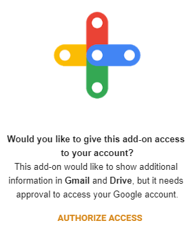
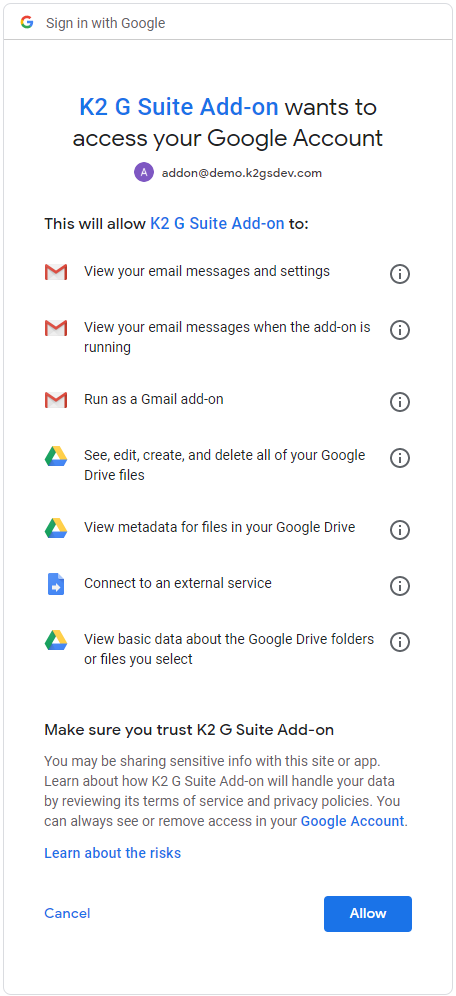
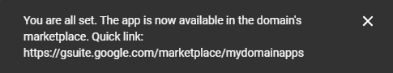
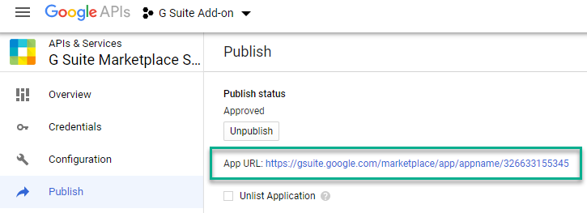
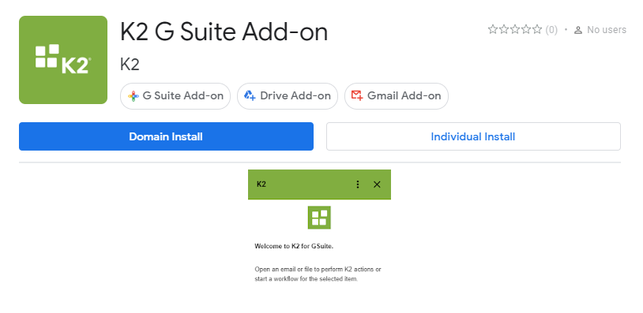
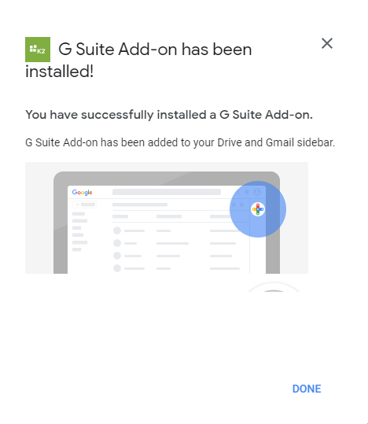
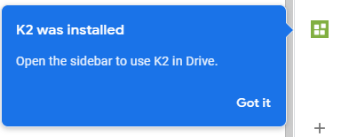

GitHub Repository: <https://github.com/k2workflow/G-Suite-Add-on>

# Development Environment

Google provides Clasp which is a Visual Studio Code extension that
allows for easier authoring and management of your Apps Scripts than
their online tooling.

- Install and configure Visual Studio Code <https://code.visualstudio.com/>
- Install and configure Clasp per the project documentation <https://github.com/google/clasp>
  - Please note that this also contains a user setting in google.

# Project Setup

The following steps are necessary to get an existing project into a new
environment and wired up for development and testing.

## Setup GCP Project

- Navigate to GCP Resource Manager <https://console.cloud.google.com/cloud-resource-manager>
- Select Create Project
- Name: K2 G Suite Add-on
- View details and copy the **Project number** value

## Setup OAuth Consent 

- Navigate to <https://console.cloud.google.com/apis/credentials/consent>
- Select User Type: Internal and Create the OAuth consent
- Application Name: K2 G Suite Add-on
- Application Logo: {Upload k2_logo.png}
- Accept defaults and Save

## Setup Apps Script Project

- Navigate to Apps Scripts <https://script.google.com/home/my>
- Select New project
- Name: K2 G Suite Add-on
- Link the Apps Script and GCP Projects
  - Resources \> Cloud Platform project...
    - Paste the Project number value from GCP project here, select Set Project, and close when successful
- View File \> Project Properties and copy the **Script ID** for VS Code

## Setup VS Code Project

- Download files from repository and open in Code
- Edit .clasp.json file and paste the Script ID as the scriptId value
- Save all files and open terminal
- Login to Google via clasp

> clasp login

## Create an App in Azure AD

K2 Cloud is currently integrated with AAD. This means that we'll need to
provide permissions to the K2 API using an AAD App. Some of the details
of this app need to be updated in the code of the project. The AAD app
also needs some details of the actual Google Project.

### Creating the AAD App

1. Login to the Azure Portal
2. Go to Azure Active Directory
3. Find the App Registration
4. Click New Registration
5. Type the name of the app, select "Accounts in any organizational directory (Any Azure AD directory - Multitenant) and personal Microsoft accounts (e.g. Skype, Xbox)"
6. Under Redirect URI, select "web" and enter the following URL, replacing the SCRIPTID: "https://script.google.com/macros/d/{SCRIPT
    ID}/usercallback" with the value entered in the `.clasp.json` file.
7. Click Register
8. Once the app is registered, go to the API Permissions.
9. Add permissions for the K2 API
    1. Click add permissions
    2. Search K2 under "APIs my organization uses"
    3. select K2 API.
    4. Select Delegate permissions
    5. Select User_impersonation
    6. Click Add permissions
10. Leave the Microsoft Graph User.Read permissions in place.
11. Go to Certificates & Secrets
12. Click New Client Secret
    1.  Enter a name, select the Expiration (for dev purposes, select Never)
    2.  COPY THE VALUE (you can only do this once!) -- this is the `ClientSecret`.
13. In the code, update the `ClientID` and `ClientSecret` in the `globalVariables.js` file. The `ClientID` can be seen in the Overview of
    the app.

#### Push the app to Google

Go back to VS Code and use the command "clasp push" to upload the code
to google.

#### Test the Add-on

- Navigate to Apps Scripts project <https://script.google.com/home/my>
- Publish \> Deploy from manifest...
- Click Install add-on - You can also perform the above step with the "clasp publish" command.
- Open Google Drive or Gmail and click on the K2 icon in the Add-on bar
- Authorize Access

The K2 G Suite Add-on has now been installed and can be tested. Changes
to code can now be made in either Apps Script or VS Code and synced
using Clasp and re-deployed using the same mechanism for testing. Most
changes can be tested by simply refreshing the add-on but 'structural'
changes, such as authentication, require full uninstall/reinstall to
test. Apps Script tools can be used to enhance debugging.

## Domain Publishing

G Suite Add-ons can be shared with others by publishing via the G Suite
marketplace for either public or private/domain access. This will
describe the process for publishing for domain access.

### Create Deployment

- Navigate to Apps Scripts project <https://script.google.com/home/my>
- Publish \> Deploy from manifest...
- Deployments: Create
- Deployment name: Initial Deployment 2020-06-25
- Manifest: appscript
- Version: New, Initial Release 0.1
- Manifest entrypoints: gmail add-on
- Click Save and then click Get Id and copy the **Deployment ID**

### Enable G Suite Marketplace SDK

- Navigate to <https://console.developers.google.com/apis/library>
- Search for and enable G Suite Marketplace SDK

### Manage G Suite Marketplace SDK

Navigate to <https://console.cloud.google.com/apis/api/appsmarket-component.googleapis.com/overview>

### Configuration

- Select Configuration
- Application info
  - Application name: K2 G Suite Add-on
  - Application description: K2 G Suite Add-on for K2 workflow APIs
  - Enable individual install: checked
- Application icons
  - Select the associated sized logos
- OAuth 2.0 Scopes

| Scope URLs |
|-----------------------------------------------------------------------|
| https://www.googleapis.com/auth/userinfo.email                        |
| https://www.googleapis.com/auth/userinfo.profile                      |
| https://www.googleapis.com/auth/script.external_request               |
| https://www.googleapis.com/auth/drive                                 |
| https://www.googleapis.com/auth/drive.metadata.readonly               |
| https://www.googleapis.com/auth/drive.addons.metadata.readonly        |
| https://www.googleapis.com/auth/gmail.readonly                        |
| https://www.googleapis.com/auth/gmail.addons.execute                  |
| https://www.googleapis.com/auth/gmail.addons.current.message.readonly |

- Support URLs
  - Terms of service URL: https://github.com/k2workflow/K2-G-Suite-Add-on

- Extensions
  - G Suite Add-ons Extension
  - Paste Apps Script project **Deployment ID**
  - NOTE: Gmail Add-ons Extension and Drive Add-ons extensions should be auto selected

- Visibility
  - Select My Domain (Only available to users at *{your domain}*)

### Publish

- Select Publish
- Detailed description
  - Application detailed description: K2 G Suite Add-on for K2 workflow APIs
- Banner (220x140): TODO
- Screenshot (640x400): TODO
- Developer website: <https://github.com/k2workflow/K2-G-Suite-Add-on>
- Developer name: K2
- Category: Office Applications
- Success toast will show App URL very quickly and is not clickable.

- Don't worry, you can now see the App URL at the top of the Publish page.

- Select to Domain or Individual Install and consent to the app

- Consent to the App and you will see a success confirmation

- Navigate to Drive or Gmail and the App will now be available via the Add-on bar

